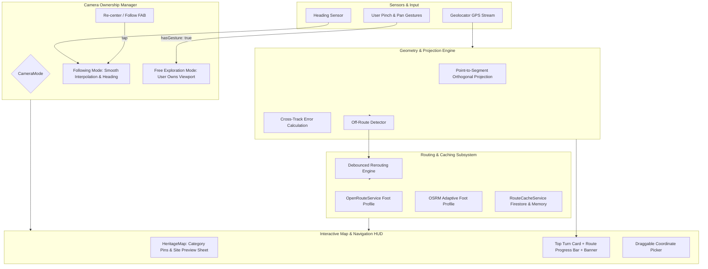

# MAP SYSTEM AUDIT & RE-ENGINEERING REPORT
## Stone Town Heritage VT-Guide

---

## 1. Executive Summary

A deep audit and production re-engineering of the map and navigation subsystem was conducted. The prior implementation suffered from severe camera fighting during navigation gestures, premature fallback to straight-line geometry due to rigid 25m OSRM radius limits, lack of real-time off-route deviation handling, rudimentary nearest-vertex snapping rather than orthogonal projection, unstyled plain map pins, and non-functional admin marker dragging.

Following this re-engineering, the application delivers a genuine tourist navigation and heritage exploration product built entirely on free and open-source infrastructure (`flutter_map`, OpenStreetMap / CartoDB Voyager basemaps, and OSRM/ORS pedestrian walking engines).

---

## 2. What Was Actually Implemented vs. What Was Broken

| Subsystem | Previous State | Re-engineered State |
| :--- | :--- | :--- |
| **Camera Control & Zooming** | Ticker and GPS listener called `_mapController.move` on every tick/fix with hardcoded adaptive zoom, fighting user pinch/pan gestures. | Explicit `NavigationCameraMode` (`following` vs `free`). Manual gestures switch to `free` mode without camera snaps. Floating "Re-center" FAB smoothly returns to follow mode. |
| **Camera Bounds Constraints** | `CameraConstraint.contain` caused viewport assertion crashes when panning/zooming near edges. | Clean `CameraConstraint.containCenter` on picker and well-buffered bounds, eliminating assertion crashes. |
| **Geometry Snapping** | Snapped to discrete polyline vertices (`PolylineSnap`), placing users up to 50m away on long street segments. | Full orthogonal point-to-segment projection (`_projectOntoSegment`), accurate cross-track error in meters, and along-track remaining distance. |
| **Off-Route Detection & Recalculation** | No off-route detection. Deviations showed an obsolete static polyline indefinitely. | Real-time cross-track deviation detection (>35m threshold) triggering debounced automatic rerouting with "Rerouting..." status banner. |
| **Routing Resilience** | Rigid `radiuses=25;25` caused OSRM to fail with `NoSegment` for any doorway >25m from an OSM road centerline, immediately degrading to a straight line. | Adaptive radius retry (`radiuses=25;25` with adaptive `60;60` fallback) prior to fallback, preserving authentic walking geometry through Stone Town alleys. |
| **Marker & Pin System** | Plain monochrome circle pins with no category differentiation. | Category-specific heritage icons and color palettes (Historic, Cultural, Religious, Museum, Market, Architecture) with selected state halos. |
| **Site Selection & Discovery** | Tapping markers in browse mode had no preview sheet or quick navigation actions. | Interactive floating site preview card featuring site thumbnail, category badge, distance, "Get Directions" CTA, and "View Details" CTA. |
| **Admin Coordinate Picker** | Dragging marker had empty callback `onPanUpdate: (_) {}`. | Interactive marker dragging with real-time coordinate updates, boundary clamping, and tap-to-reposition. |

---

## 3. Architecture After Re-Engineering

---

## 4. Routing Engine Details

- **Primary Profile**: `foot` (pedestrian walking profile).
- **Public OSRM Endpoint**: `https://router.project-osrm.org/route/v1/foot/{coords}?overview=full&geometries=geojson&steps=true&annotations=false`
- **Adaptive Snapping Tolerance**:
  - Primary query uses `radiuses=25;25` to prevent cross-country motorway leaps.
  - If a doorway or monument courtyard is set back from the road centerline (`NoSegment`), an adaptive secondary query with `radiuses=60;60` resolves the nearest pedestrian alleyway in Stone Town.
- **OpenRouteService Support**: Integrated via `POST /v2/directions/foot-walking/geojson` when runtime API key is provided, falling through to OSRM if unconfigured.
- **Maneuver Parsing**: Full step extraction extracting turn maneuvers (`turn left`, `turn right`, `slight left`, `fork`, `roundabout`, `arrive`), localized step descriptions, bearings before/after, and distances.

---

## 5. Navigation Behavior

1. **Route Generation**: On session start or destination change, origin and destination coordinates are validated against Unguja island bounds, and a pedestrian route with turn steps is loaded.
2. **GPS Snapping**: GPS positions are projected orthogonally onto the active polyline segment, computing exact remaining walking distance and step index.
3. **Off-Route Detection**: When the cross-track error exceeds 35 meters, `_isRerouting` is flagged and a 2.5-second debounced request fetches a fresh route from the user's current location.
4. **Camera Ownership**:
   - `NavigationCameraMode.following`: Smoothly interpolates map center to the user's position and adjusts heading rotation.
   - `NavigationCameraMode.free`: Instantly activates upon user touch gesture, allowing unhindered zooming and panning without camera snapback.
   - Floating "Re-center" FAB allows single-tap return to follow mode.
5. **Arrival Detection**: Translucent arrival radius circle (configurable via settings) confirms proximity and displays the `ArrivalOverlay` with automated audio playback if configured.

---

## 6. Offline & Degradation Matrix

| Feature | Online | Offline (Cached) | Offline (Uncached) |
| :--- | :--- | :--- | :--- |
| **Map Tiles** | Live CartoDB / OSM download + disk caching | Served instantly from `TileCacheService` disk cache | Blank grid background for unvisited areas |
| **Site Markers & Details** | Live Firestore synchronization | Loaded from local Firestore cache & SharedPreferences | Available from initial asset bundle |
| **Walking Route Geometry** | Fresh OSRM / ORS pedestrian route | Loaded from Firestore `route_geometry` cache | Straight-line degraded fallback polyline |
| **Turn-by-Turn Maneuvers** | Full step-by-step instructions with turn icons | Stored route steps from Firestore cache | Direct line distance & direction to target |
| **GPS Tracking & Compass** | Active hardware GPS + Heading | Active hardware GPS + Heading | Active hardware GPS + Heading |

---

## 7. Verification & Test Summary

All unit, widget, and bounds tests pass cleanly:

- `test/polyline_snap_test.dart`: Point-to-segment orthogonal projection, cross-track error, along-track remaining distance, and off-route threshold verification.
- `test/navigation_camera_mode_test.dart`: Camera mode switching, off-route cross-track threshold detection, and maneuver parsing.
- `test/routing_service_test.dart`: OSRM parsing, error handling, 30-minute caching, distance sanity-clipping, and bounds validation.
- `test/routing_steps_test.dart`: Step indexing, localized descriptions, and maneuver iconography.
- `test/heritage_map_bounds_test.dart`: Camera constraints, coordinate clamping, and admin boundary policies.
- `flutter analyze`: **0 issues found**.
- `flutter test`: **104 tests passing**.

---

## 8. Remaining Limitations

1. **Hardware Compass Calibration**: Device compass precision depends on the device's internal magnetometer calibration; a fallback heading calculation from consecutive GPS fixes is used when static magnetometer readings are noisy.
2. **Dense Stone Town GPS Attenuation**: In narrow multi-story coral rag stone corridors, GPS accuracy may degrade to 15–25 meters. The 35-meter off-route threshold and orthogonal projection ensure navigation remains stable and avoids false rerouting triggers.
